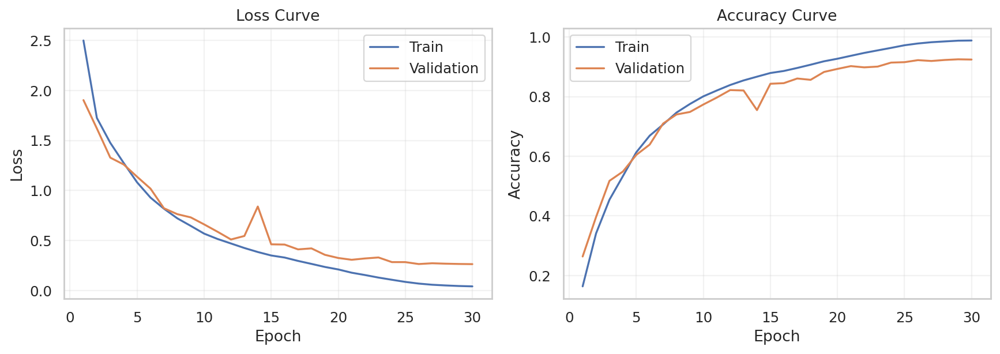
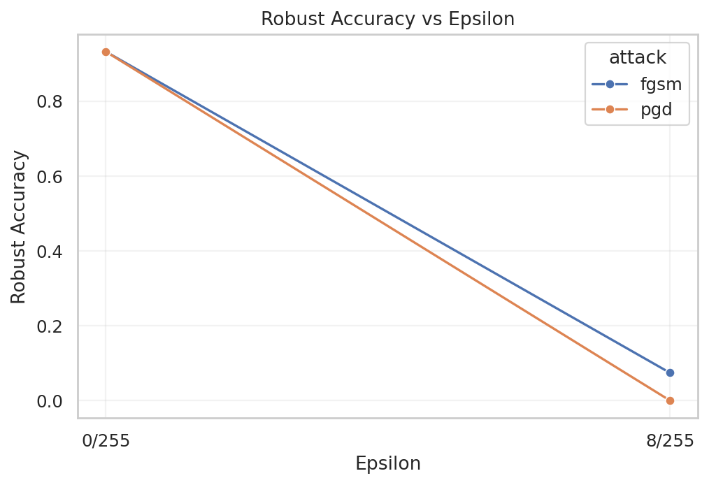
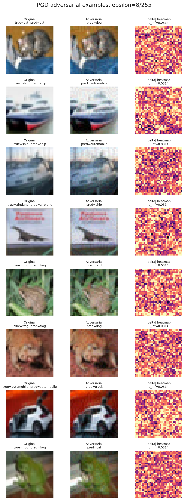
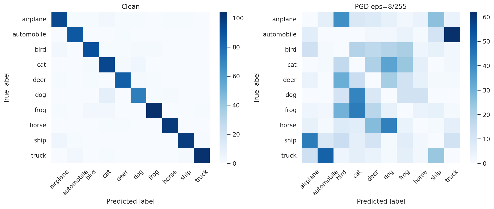
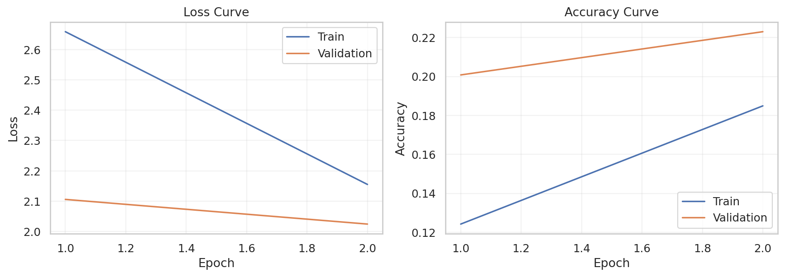
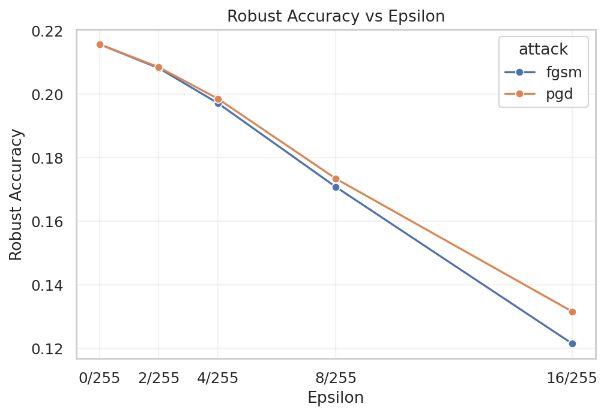
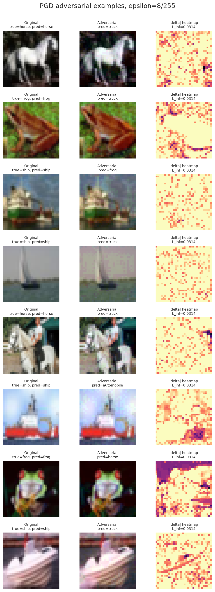
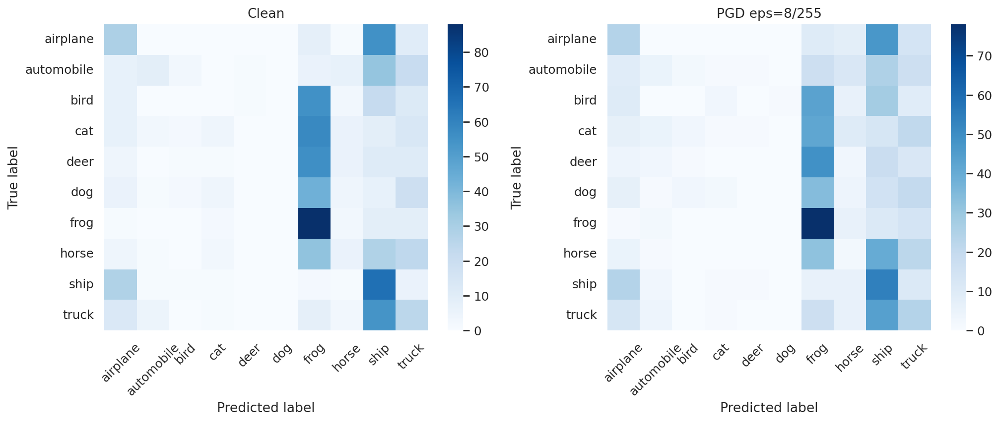

# CIFAR-10 对抗样本攻击与 PGD 对抗训练实验报告

## 1. 实验目的

本实验基于 CIFAR-10 图像分类任务，构建 ResNet-18 分类模型，并在 `L_inf` 约束下使用 FGSM 与 PGD 生成对抗样本，验证标准深度模型对微小扰动的敏感性。同时引入 PGD 对抗训练作为防御方法，观察其训练过程和对抗鲁棒性变化。

## 2. 实验方法

实验采用 CIFAR-10 数据集，训练集与验证集从官方训练集划分，测试集使用官方测试集。模型采用适配 32x32 图像输入的 ResNet-18：首层卷积修改为 `3x3, stride=1, padding=1`，去除原始 ImageNet 结构中的 maxpool，并将最终分类层设为 10 类输出。

攻击方法包括 FGSM 与 PGD。二者均在像素空间 `[0, 1]` 内生成 `L_inf` 约束扰动，主要攻击强度为 `epsilon=8/255`。PGD 评估采用多步迭代攻击，实验中使用 `pgd_steps=10`。

防御方法采用 PGD 对抗训练。训练阶段对每个 batch 先生成 PGD 对抗样本，再用对抗样本更新模型参数。当前实验中自然模型完成 30 个 epoch；PGD 对抗训练模型仅完成 2 个 epoch，因此其结果主要用于流程验证，不作为充分训练后的最终防御性能结论。

## 3. 实验流程

实验流程如下：

1. 配置 Conda 与 PyTorch GPU 环境。
2. 下载并加载 CIFAR-10 数据集。
3. 训练自然 ResNet-18 模型。
4. 使用 FGSM 与 PGD 评估自然模型的对抗鲁棒性。
5. 使用 PGD 对抗训练训练防御模型。
6. 使用相同攻击配置评估防御模型。
7. 生成训练曲线、鲁棒准确率曲线、对抗样本图和混淆矩阵。

## 4. 自然模型训练结果

自然训练模型完成 30 个 epoch。训练损失从 `2.4980` 降至 `0.0423`，训练准确率从 `0.1634` 提升至 `0.9881`；验证准确率最高达到 `0.9250`，最终 epoch 验证准确率为 `0.9242`。



从训练曲线可以看出，自然模型在前 10 个 epoch 内快速收敛，随后训练准确率持续上升并接近 1.0。验证准确率最终稳定在约 0.92 左右，说明模型已经较好拟合 CIFAR-10 分类任务。训练准确率与验证准确率后期存在一定差距，体现出轻微过拟合，但总体训练结果可作为有效攻击基线。

## 5. 自然模型攻击结果

在 1000 张测试样本子集上，自然模型评估结果如下：

| Model | Attack | Epsilon | Clean Acc | Robust Acc | Attack Success Rate |
|---|---|---:|---:|---:|---:|
| Natural ResNet-18 | FGSM | 0/255 | 0.9320 | 0.9320 | 0.0000 |
| Natural ResNet-18 | FGSM | 8/255 | 0.9320 | 0.0740 | 0.9217 |
| Natural ResNet-18 | PGD-10 | 0/255 | 0.9320 | 0.9320 | 0.0000 |
| Natural ResNet-18 | PGD-10 | 8/255 | 0.9320 | 0.0000 | 1.0000 |



结果表明，自然模型在干净样本上准确率较高，但在 `epsilon=8/255` 的扰动下鲁棒准确率急剧下降。FGSM 攻击后准确率仅为 `0.0740`，PGD-10 攻击后鲁棒准确率降至 `0.0000`，说明自然训练模型几乎无法抵抗强一阶迭代攻击。

## 6. 自然模型对抗样本可视化



可视化结果展示了原始图像、PGD 对抗图像以及扰动热力图。扰动强度为 `L_inf=0.0314`，即约 `8/255`。从视觉上看，对抗图像与原图差异较小，但模型预测结果发生明显变化，例如：

- `cat -> dog`
- `ship -> automobile`
- `airplane -> ship`
- `frog -> bird / dog / cat`
- `automobile -> truck`

这说明对抗扰动虽然幅度有限，但能够有效改变模型决策边界附近样本的分类结果。

## 7. 自然模型混淆矩阵分析



干净样本混淆矩阵中，对角线颜色明显更深，表示自然模型在正常测试样本上分类较准确。PGD 攻击后，对角线显著减弱，错误预测分布扩散到多个类别，说明攻击破坏了模型原有的类别判别结构。特别是部分类别被集中误分到视觉相近或模型偏置较强的类别中，体现出 PGD 攻击的强破坏性。

## 8. PGD 对抗训练过程

PGD 对抗训练模型当前完成 2 个 epoch。训练日志如下：

| Epoch | Train Loss | Train Acc | Val Loss | Val Acc |
|---:|---:|---:|---:|---:|
| 1 | 2.6588 | 0.1242 | 2.1057 | 0.2008 |
| 2 | 2.1551 | 0.1849 | 2.0244 | 0.2230 |



从曲线看，PGD 对抗训练在前 2 个 epoch 内 loss 开始下降，accuracy 有小幅提升，但整体准确率仍然很低。由于对抗训练比自然训练困难得多，2 个 epoch 远不足以得到稳定的鲁棒模型。因此后续防御结果应解释为“对抗训练流程已跑通”，而非“防御方法已充分收敛”。

## 9. PGD 对抗训练模型评估

PGD 对抗训练模型在测试集上的评估结果如下：

| Model | Attack | Epsilon | Clean Acc | Robust Acc | Attack Success Rate |
|---|---|---:|---:|---:|---:|
| PGD-AT ResNet-18 | FGSM | 0/255 | 0.2157 | 0.2157 | 0.0000 |
| PGD-AT ResNet-18 | FGSM | 2/255 | 0.2157 | 0.2082 | 0.0723 |
| PGD-AT ResNet-18 | FGSM | 4/255 | 0.2157 | 0.1972 | 0.1428 |
| PGD-AT ResNet-18 | FGSM | 8/255 | 0.2157 | 0.1708 | 0.2707 |
| PGD-AT ResNet-18 | FGSM | 16/255 | 0.2157 | 0.1215 | 0.4905 |
| PGD-AT ResNet-18 | PGD-10 | 0/255 | 0.2157 | 0.2157 | 0.0000 |
| PGD-AT ResNet-18 | PGD-10 | 2/255 | 0.2157 | 0.2085 | 0.0723 |
| PGD-AT ResNet-18 | PGD-10 | 4/255 | 0.2157 | 0.1986 | 0.1442 |
| PGD-AT ResNet-18 | PGD-10 | 8/255 | 0.2157 | 0.1734 | 0.2735 |
| PGD-AT ResNet-18 | PGD-10 | 16/255 | 0.2157 | 0.1316 | 0.4525 |



随着 `epsilon` 从 `0/255` 增大到 `16/255`，模型鲁棒准确率逐步下降，符合扰动强度越大、攻击越强的基本规律。但由于该模型仅训练 2 个 epoch，clean accuracy 仅为 `0.2157`，分类能力尚未充分形成，因此不能直接与 30 epoch 的自然模型做最终性能比较。

## 10. PGD 对抗训练模型可视化



对抗样本图显示，在 `epsilon=8/255` 下，PGD 攻击仍可导致模型预测错误，例如 `horse -> truck`、`frog -> truck`、`ship -> automobile` 等。扰动热力图相较自然模型更稀疏，但由于模型尚未充分训练，预测结果本身稳定性不足。



混淆矩阵显示，模型在干净样本和 PGD 样本上的预测均存在明显类别偏置，部分类别被频繁预测为 `frog` 或 `ship`。这进一步说明当前 PGD-AT 模型仍处于早期训练状态，需要继续训练至 30 epoch 或更长时间后再进行正式防御效果比较。

## 11. 结论

本实验完成了 CIFAR-10 上 ResNet-18 自然训练、FGSM/PGD 攻击、PGD 对抗训练与可视化分析的完整流程。自然模型在干净样本上达到较高准确率，验证准确率最高为 `0.9250`；但在 `epsilon=8/255` 的 PGD-10 攻击下，鲁棒准确率降至 `0.0000`，说明标准训练模型对对抗扰动高度敏感。

PGD 对抗训练部分已经成功运行并生成结果，但当前仅训练 2 个 epoch，模型准确率较低，因此只能说明流程有效，尚不能作为充分防御结论。后续应继续完成 30 epoch PGD 对抗训练，再使用相同 FGSM/PGD 配置评估其 clean accuracy 与 robust accuracy，从而严谨比较自然训练与对抗训练之间的鲁棒性差异。

## 12. 后续完善建议

1. 将 PGD 对抗训练继续运行至 30 epoch。
2. 对自然模型和 PGD-AT 模型均使用完整测试集评估。
3. 对自然模型补充 `2/255, 4/255, 16/255` 多扰动强度评估。
4. 在最终报告中统一比较 `Natural` 与 `PGD-AT` 的 `Clean Acc`、`FGSM Robust Acc` 和 `PGD Robust Acc`。
5. 如时间允许，增加 PGD-20 或 AutoAttack 作为更严格鲁棒性评估。

## 13. 关键代码定位与伪代码说明

本节对应实验中的数据集处理、模型构建、攻击生成、对抗训练和评估流程，便于将报告内容与实际实现对应。

### 13.1 数据集加载与划分

相关代码位置：

| 实验内容 | 代码位置 | 说明 |
|---|---|---|
| 训练集增强 | `src/data.py:12-20` | 使用 `RandomCrop`、`RandomHorizontalFlip` 和 `ToTensor` |
| 验证/测试预处理 | `src/data.py:22-23` | 测试阶段仅使用 `ToTensor` |
| CIFAR-10 数据集加载 | `src/data.py:40-63` | 加载 train/test，并构造 train/val/test 数据集 |
| 训练/验证划分 | `src/data.py:52-53` | 从 50000 张训练图像中划分验证集与训练集 |
| DataLoader 构建 | `src/data.py:66-88` | 构建 train、val、test 三个 DataLoader |
| 测试集加载 | `src/data.py:94-108` | 评估与可视化阶段加载 CIFAR-10 test set |

伪代码如下：

```text
Input: CIFAR-10 official training set and test set

Define train_transform:
    RandomCrop(32, padding=4)
    RandomHorizontalFlip()
    ToTensor()

Define eval_transform:
    ToTensor()

Load CIFAR-10 training set
Shuffle indices with fixed seed
Split:
    validation_indices = first 5000 indices
    training_indices = remaining 45000 indices

Build:
    train_dataset = CIFAR10(train=True, train_transform)[training_indices]
    val_dataset   = CIFAR10(train=True, eval_transform)[validation_indices]
    test_dataset  = CIFAR10(train=False, eval_transform)

Return train_loader, val_loader, test_loader
```

### 13.2 模型结构与输入归一化

相关代码位置：

| 实验内容 | 代码位置 | 说明 |
|---|---|---|
| CIFAR-10 标准化层 | `src/models.py:12-21` | 将 mean/std 注册为模型 buffer |
| ResNet-18 CIFAR 适配 | `src/models.py:24-35` | 修改首层卷积并去除 maxpool |
| 模型构建函数 | `src/models.py:38-39` | 返回 CIFAR-style ResNet-18 |

伪代码如下：

```text
Input image x in pixel space [0, 1]

Normalize:
    x_norm = (x - CIFAR10_MEAN) / CIFAR10_STD

Backbone:
    ResNet18
    conv1 = 3x3 convolution, stride=1, padding=1
    maxpool = Identity
    final_fc = Linear(..., 10)

Output:
    logits = ResNet18(x_norm)
```

该设计使攻击算法直接在 `[0, 1]` 像素空间中添加扰动，`epsilon=8/255` 的物理含义更加明确。

### 13.3 FGSM 攻击方法

相关代码位置：

| 实验内容 | 代码位置 | 说明 |
|---|---|---|
| FGSM 主函数 | `src/attacks.py:25-44` | 实现单步梯度符号攻击 |
| 交叉熵损失 | `src/attacks.py:40` | 以真实标签为目标计算分类损失 |
| 输入梯度计算 | `src/attacks.py:41` | 对输入图像求梯度 |
| 扰动生成与裁剪 | `src/attacks.py:42-43` | 添加 `epsilon * sign(grad)` 并裁剪到 `[0, 1]` |

FGSM 公式为：

```text
x_adv = clip(x + epsilon * sign(gradient_x loss(model(x), y)), 0, 1)
```

伪代码如下：

```text
Function FGSM(model, x, y, epsilon):
    x_adv = clone(x)
    enable gradient for x_adv

    logits = model(x_adv)
    loss = CrossEntropy(logits, y)
    grad = gradient(loss, x_adv)

    x_adv = x_adv + epsilon * sign(grad)
    x_adv = clip(x_adv, 0, 1)

    return x_adv
```

### 13.4 PGD 攻击方法

相关代码位置：

| 实验内容 | 代码位置 | 说明 |
|---|---|---|
| PGD 主函数 | `src/attacks.py:47-78` | 实现多步投影梯度攻击 |
| 随机初始化 | `src/attacks.py:62-64` | 在 `[-epsilon, epsilon]` 内随机启动 |
| 迭代更新 | `src/attacks.py:69-76` | 多次沿梯度符号方向更新 |
| 投影约束 | `src/attacks.py:75` | 将扰动限制在 `L_inf <= epsilon` |
| 像素范围裁剪 | `src/attacks.py:76` | 保证对抗样本仍位于 `[0, 1]` |

PGD 可视为多步 FGSM，并在每一步后执行投影：

```text
x_adv^{t+1} = Project_{||x_adv - x||_inf <= epsilon}
              (x_adv^t + alpha * sign(gradient_x loss(model(x_adv^t), y)))
```

伪代码如下：

```text
Function PGD(model, x, y, epsilon, alpha, steps):
    if random_start:
        x_adv = x + Uniform(-epsilon, epsilon)
        x_adv = clip(x_adv, 0, 1)
    else:
        x_adv = clone(x)

    for step in 1 ... steps:
        enable gradient for x_adv
        logits = model(x_adv)
        loss = CrossEntropy(logits, y)
        grad = gradient(loss, x_adv)

        x_adv = x_adv + alpha * sign(grad)
        delta = clip(x_adv - x, -epsilon, epsilon)
        x_adv = clip(x + delta, 0, 1)

    return x_adv
```

### 13.5 PGD 对抗训练

相关代码位置：

| 实验内容 | 代码位置 | 说明 |
|---|---|---|
| 训练单个 epoch | `src/train.py:63-108` | 完成训练循环 |
| PGD-AT 分支 | `src/train.py:80-91` | 若 `mode=pgd-at`，先生成 PGD 对抗样本 |
| 参数更新 | `src/train.py:95-102` | 使用对抗样本计算 loss 并更新模型 |
| 验证集评估 | `src/train.py:113-127` | 每个 epoch 后在验证集上评估 clean accuracy |
| 保存训练曲线 | `src/train.py:169-170` | 写入 `history.csv` |
| 保存 checkpoint | `src/train.py:181-184` | 保存 `last.pt` 与 `best.pt` |

伪代码如下：

```text
For each epoch:
    For each batch (x, y) in train_loader:

        if mode == "pgd-at":
            x_train = PGD(
                model=model,
                x=x,
                y=y,
                epsilon=8/255,
                alpha=2/255,
                steps=3
            )
        else:
            x_train = x

        logits = model(x_train)
        loss = CrossEntropy(logits, y)

        optimizer.zero_grad()
        backward(loss)
        optimizer.step()

    Evaluate model on validation set
    Save history.csv
    Save last.pt and best.pt
```

该流程对应报告中“自然训练模型”和“PGD 对抗训练模型”的训练曲线。

### 13.6 攻击评估与指标计算

相关代码位置：

| 实验内容 | 代码位置 | 说明 |
|---|---|---|
| 攻击选择 | `src/evaluate.py:37-61` | 根据 `fgsm/pgd` 调用对应攻击函数 |
| 评估主流程 | `src/evaluate.py:64-148` | 计算 clean 和 adversarial 预测 |
| 混淆矩阵统计 | `src/evaluate.py:84`、`src/evaluate.py:126` | 保存真实类别与预测类别统计 |
| 鲁棒准确率 | `src/evaluate.py:142` | `adv_correct / total` |
| 攻击成功率 | `src/evaluate.py:143` | 在 clean correct 样本中统计攻击成功比例 |
| 多 epsilon 循环 | `src/evaluate.py:169-184` | 对不同扰动强度重复评估 |
| 指标保存 | `src/evaluate.py:193-194` | 写入 `metrics.csv` |

伪代码如下：

```text
For each attack in [FGSM, PGD]:
    For each epsilon in epsilon_list:
        clean_correct = 0
        adv_correct = 0
        attack_success = 0

        For each batch (x, y) in test_loader:
            clean_pred = argmax(model(x))

            x_adv = attack(model, x, y, epsilon)
            adv_pred = argmax(model(x_adv))

            clean_correct += count(clean_pred == y)
            adv_correct += count(adv_pred == y)
            attack_success += count(clean_pred == y and adv_pred != y)

            update confusion_matrix[y, adv_pred]

        clean_acc = clean_correct / total
        robust_acc = adv_correct / total
        attack_success_rate = attack_success / clean_correct

        save metrics row
```

### 13.7 可视化生成

相关代码位置：

| 实验内容 | 代码位置 | 说明 |
|---|---|---|
| 训练曲线 | `src/visualize.py:41-63` | 绘制 loss 和 accuracy 曲线 |
| 鲁棒准确率曲线 | `src/visualize.py:66-80` | 绘制 robust accuracy vs epsilon |
| 对抗样本图 | `src/visualize.py:110-184` | 绘制原图、对抗图、扰动热力图 |
| 扰动热力图 | `src/visualize.py:167-178` | 计算 `abs(delta)` 并显示 |
| 混淆矩阵图 | `src/visualize.py:187-251` | 绘制 clean 与 PGD 攻击后的混淆矩阵 |

伪代码如下：

```text
Plot training curves:
    read history.csv
    plot train_loss and val_loss
    plot train_acc and val_acc

Plot robust curve:
    read metrics.csv
    x-axis = epsilon
    y-axis = robust_acc
    hue = attack type

Plot adversarial examples:
    load model and test images
    generate x_adv by FGSM or PGD
    show:
        original image
        adversarial image
        abs(x_adv - x) heatmap

Plot confusion matrix:
    compute clean predictions
    compute adversarial predictions
    draw two heatmaps for comparison
```

通过上述代码定位可以看出，本实验的“数据集划分、攻击样本生成、PGD 对抗训练、鲁棒性评估、可视化分析”均具有明确的实现路径，报告中的每一类实验结果都可追溯到对应源码位置。
